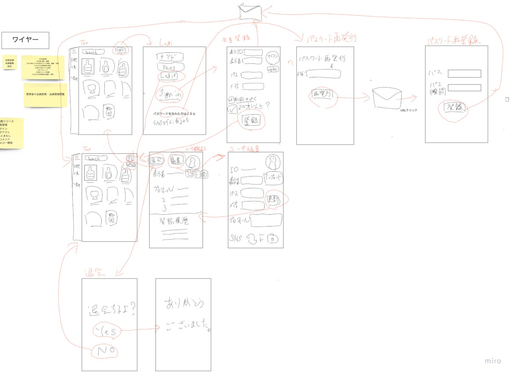
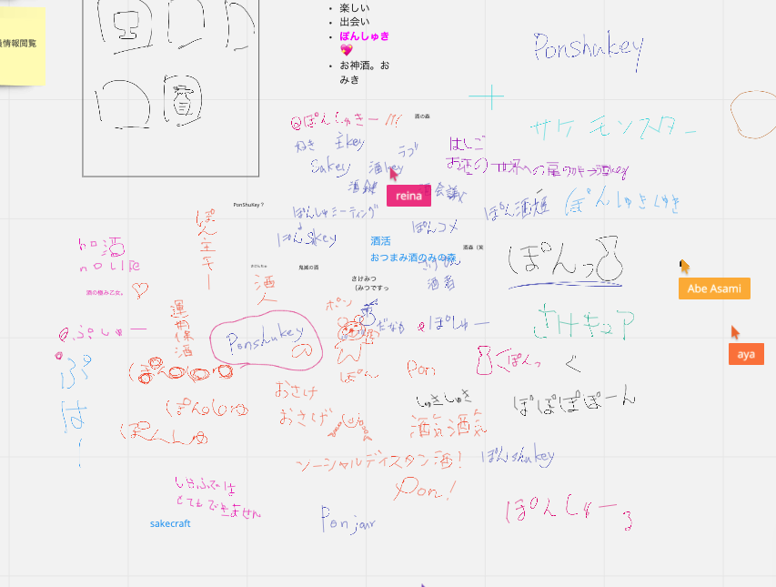

# 第2回 システム設計〜画面編〜 2020/05/17 14:00-17:00
[https://javajo.doorkeeper.jp/events/106020](https://javajo.doorkeeper.jp/events/106020)
## 議事録作成者
yuki

## 参加者(敬称略)
- 桑折
- maaya8585
- らん
- robo
- yuki
- まさみ
- あや
- mii
- きのこ
- よこな
- れいな
- えり
- momoko

## 議題にしたいこと or 前回の next action
- アイスブレイク
  - 名前
  - 住んでる地域
  - 最近の気になる技術トピック
- 前回のおさらい
- WEB版のつくらねばならない画面の一覧作成
- 画面別issueの作成

## 議事内容
### 前回のおさらい
#### RDRAを使って要件定義
- 提案者の方からのフィードバック
    - 詳細はDiscord参照
    - 関係者の認識が合うことが目的．粒度や細かさはケースバイケースで．開発者間では前回作成のレベルでよさそう
    - 画面設計はRDRAの範囲外なので他のツールなどでやるとよさそう
    - 利用シーン vs UC(Use Case)
        - 利用シーン:利用者がシステムをどのように利用するか (Ex. コメントくれた人をフォローする)
        - UC: システムの機能，処理のかたまり．利用シーンを実現するには？ (Ex. ユーザのフォロ-)

### ワイヤーフレーム検討
- [miroはこちら](https://miro.com/app/board/o9J_ktzRgdo=/)

#### コメント
- トップ画面はPinterestっぽいものを
- 管理者用画面(機能も)は後々検討でもよい？
    - DBを直接操作
- 将来的におつまみ情報からお酒を検索できるとよい
    - おつまみ情報を独立して扱う
- スマホ画面で開くことを念頭に
- まずは日本酒検索機能を重点的に
    - レコメンドやフォロー系はおいておく

### サービス名~~大喜利~~検討

##  決まったこと
- サービス名は**ぽんしゅきー**に!
- ワイヤーフレーム for ユーザ管理周り

## next action(タスク洗い出し)
### 宿題
- [ ] UIトレンド/ガイドラインを探す
- [ ] ペーパーモック作成(Discord参照)

### 次回やること
- 画面設計その2
    - 日本酒登録
    - 管理者画面

## 議事録作成者の感想ひとこと
- 業務で要件定義やワイヤーフレーム定義を行うことがないので，今回も個人的にはとても新鮮でした．要件定義には決まったフォーマットがあるのかと思っていましたが，「関係者で認識が合うこと」が重要ですね．
- 「顔を赤らめて**ぽんしゅき〜**」
