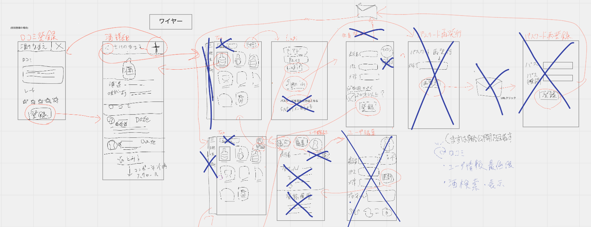

# 第3回 システム設計〜画面編2〜 2020/06/21 14:00-17:00

[https://javajo.doorkeeper.jp/events/106887](https://javajo.doorkeeper.jp/events/106887)  

## 議事録作成者
mii

## 参加者(敬称略)
- あや
- maaya8585
- robo
- らん
- mii
- 桑折
- みさと
- きのこ
- yuki
- えり
- momoko
- よこな

## 議題にしたいこと or 前回の next action
- アイスブレイク
  - 名前
  - 最近のお仕事内容(話せる範囲で)
  - コロナ禍に入ってから買った重宝しているアイテム
- 前回のおさらい
- 画面モック作成内容共有
  - いちご(ありがとう!)  
    prottapp(https://prottapp.com/ja/)  
    https://prottapp.com/p/7788be
  - mii(ありがとう!)  
    AdobeXD(https://www.adobe.com/jp/products/xd.html)  
    https://xd.adobe.com/view/28f5164b-49e8-4baa-6847-060d0cef6e22-5ec4/
- WEB版のつくらねばならない画面の一覧作成: 前回の続きから
- 画面別issueの作成

## 議事内容
### 今後の開発方針
- 今まで作った画面遷移をもとに、最低限の機能に絞ってなるはやで開発に入りたい
- 最初は手分けするのではなく、モブプロのような形式でみんなで開発する
- デザインに迷ったらUIデザインガイドラインなどを参考にする
  - UIデザインガイドライン(Google Material Design) https://material.io/design

### 画面の優先度検討
[miroはこちら](https://miro.com/app/board/o9J_ktzRgdo=/)
- 初回(身内向け)では口コミ、日本酒表示、最低限のユーザー情報に絞る
  - ユーザー情報
    - 表示名,パスワード,メールアドレス,アイコン(システムで用意したいくつかから選択)
    - ユーザー情報表示、編集、退会は初回は作らない。登録時のメールアドレスの確認も行わない
  - 日本酒表示
    - 日本酒一覧
      - 最初は検索はしない、登録されている日本酒を無限スクロールで表示する
    - 日本酒詳細
      - 日本酒の基本情報と口コミ表示
      - ログインしている場合は口コミ投稿ボタンが表示される
  - 口コミ登録
    - 日本酒詳細画面から遷移
    - テキスト、レート(星)
    - すでに口コミ投稿している場合は、投稿した内容が表示される

### 画面別issueの作成
- 口コミ登録画面作成 (https://github.com/java-women/JavajoPonsyu/issues/1)
- 酒詳細画面 (https://github.com/java-women/JavajoPonsyu/issues/2)
- 酒検索画面(TOP画面) (https://github.com/java-women/JavajoPonsyu/issues/3)
- ログイン画面 (https://github.com/java-women/JavajoPonsyu/issues/4)
- 会員登録画面 (https://github.com/java-women/JavajoPonsyu/issues/5)

### 技術スタック検討
技術スタック (https://github.com/java-women/JavajoPonsyu/issues/6)

##  決まったこと
ワイヤーフレーム
  

## next action(タスク洗い出し)
- みんなで開発環境をととのえる
- フロント実装する(APIはmock)
- 宿題
  - フロントフレームワーク戦争 決選投票するので考えてくる
    - Vue.js(Nuxt.js)
    - React
    - Flutter
  - しれっとイベント名ぽんしゅ館→ぽんしゅきーに変える

## 議事録作成者の感想ひとこと
もりもり話が進んで楽しくなってきました！  
Just Dance体験版やります(mii)
